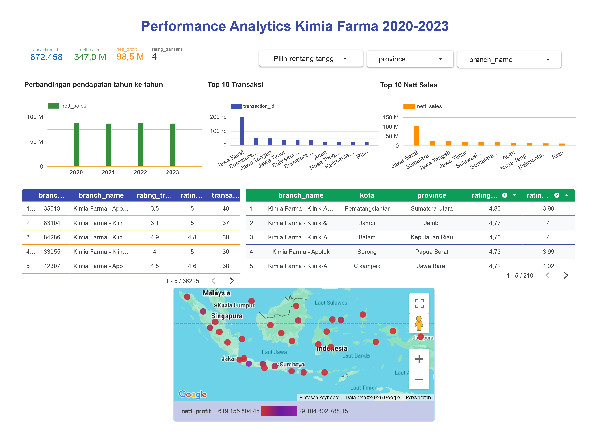
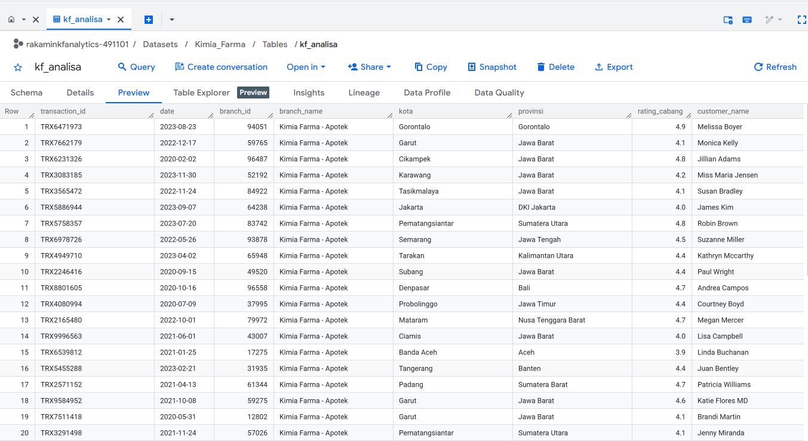
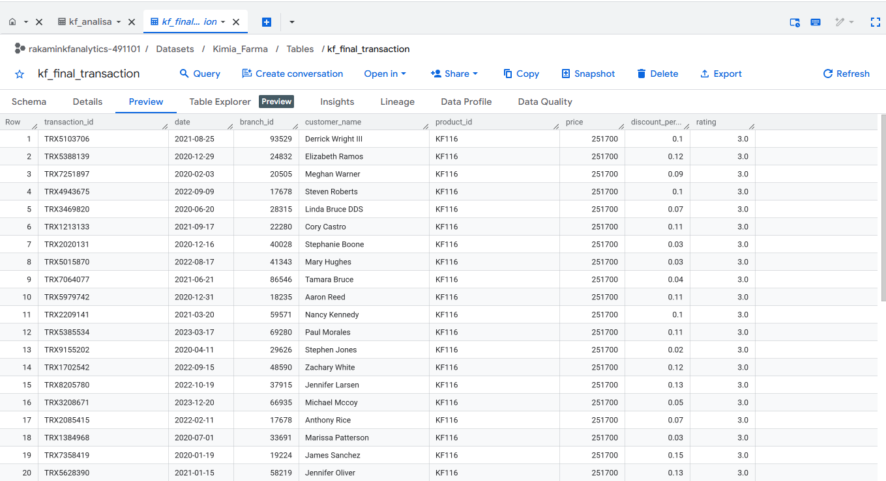

# 📊 Performance Analytics Kimia Farma (2020-2023)

Proyek ini merupakan hasil dari **Virtual Internship** di **Kimia Farma**. Fokus utama proyek ini adalah menganalisis kinerja bisnis perusahaan selama periode 2020 hingga 2023 dengan mengolah dataset transaksi skala besar menggunakan teknologi Cloud.

### 📈 Business Dashboard Overview

### 🛠️ Tech Stack & Tools:
* **Google BigQuery (SQL)**: Digunakan untuk melakukan ekstraksi, pembersihan, dan transformasi data transaksi (*Data Processing*).
* **Google Looker Studio**: Digunakan untuk membangun dashboard interaktif yang memvisualisasikan metrik utama bisnis.

### 🔍 Key Metrics & Insights:
* **Transaction Overview**: Berhasil memproses lebih dari **672 ribu transaksi** dengan total **Nett Sales mencapai 347 Miliar**.
* **Regional Performance**: Mengidentifikasi Jawa Barat sebagai wilayah dengan volume transaksi dan total penjualan tertinggi.
* **Profitability Mapping**: Memvisualisasikan persebaran *Nett Profit* di seluruh Indonesia melalui peta interaktif untuk melihat efektivitas cabang.
* **Comparison**: Menganalisis perbandingan pendapatan tahun ke tahun untuk memantau tren pertumbuhan bisnis secara konsisten.

### 📂 Repository Structure:
* `kf_analisa.sql`: Kode SQL untuk pemrosesan data di BigQuery.
* `dashboard.jpg`: Screenshot hasil visualisasi data.
* `README.md`: Dokumentasi proyek.
### 🛠️ Data Transformation & SQL Logic
Berikut adalah proses transformasi data menggunakan SQL di Google BigQuery:

Gambar di atas menampilkan proses otomasi perhitungan profitabilitas menggunakan SQL di Google BigQuery. Alur ini dirancang untuk menetapkan margin laba secara dinamis berdasarkan kategori harga produk, sekaligus melakukan kalkulasi pendapatan bersih (Nett Sales) secara instan terhadap ratusan ribu baris data transaksi.
### 🛠️ SQL Logic: Automated Profitability Calculation
> **Insight:** Menggunakan logika `CASE WHEN` untuk menetapkan margin laba (10% - 30%) secara otomatis, memastikan perhitungan profit akurat sesuai dengan tier harga produk Kimia Farma.

### 📋 Final Table Preview
Tampilan tabel hasil olahan (`kf_final_transaction`) yang siap dihubungkan ke Looker Studio:

Hasil akhir transformasi data (Datamart) yang telah mengintegrasikan data transaksi, profil cabang, dan katalog produk. Tabel ini sudah divalidasi dan dibersihkan sehingga siap digunakan sebagai sumber data tunggal (Single Source of Truth) untuk pembuatan dashboard visual di Looker Studio.
### 📋 Final Analysis Table (Datamart)

> **Key Feature:** Tabel ini merangkum data dari 4 tabel berbeda melalui proses `LEFT JOIN`, memungkinkan analisis mendalam per wilayah, per produk, hingga per rating cabang.
Data Transformation & Business Logic Automation"
> **Kode SQL**
CREATE OR REPLACE TABLE `rakaminkfanalytics-491101.Kimia_Farma.kf_analisa` AS
SELECT
    ft.transaction_id,
    ft.date,
    ft.branch_id,
    kc.branch_name,
    kc.kota,
    kc.provinsi,
    kc.rating AS rating_cabang,
    ft.customer_name,
    ft.product_id,
    p.product_name,
    ft.price AS actual_price,
    ft.discount_percentage,
    
    CASE
        WHEN ft.price <= 50000 THEN 0.10
        WHEN ft.price > 50000 AND ft.price <= 100000 THEN 0.15
        WHEN ft.price > 100000 AND ft.price <= 300000 THEN 0.20
        WHEN ft.price > 300000 AND ft.price <= 500000 THEN 0.25
        WHEN ft.price > 500000 THEN 0.30
    END AS persentase_gross_laba,

    ft.price * (1 - ft.discount_percentage / 100) AS nett_sales,

    ft.price * (1 - ft.discount_percentage / 100) * CASE
        WHEN ft.price <= 50000 THEN 0.10
        WHEN ft.price > 50000 AND ft.price <= 100000 THEN 0.15
        WHEN ft.price > 100000 AND ft.price <= 300000 THEN 0.20
        WHEN ft.price > 300000 AND ft.price <= 500000 THEN 0.25
        WHEN ft.price > 500000 THEN 0.30
    END AS nett_profit,

    ft.rating AS rating_transaksi

FROM `rakaminkfanalytics-491101.Kimia_Farma.kf_final_transaction` ft
LEFT JOIN `rakaminkfanalytics-491101.Kimia_Farma.kf_kantor_cabang` kc
    ON ft.branch_id = kc.branch_id
LEFT JOIN `rakaminkfanalytics-491101.Kimia_Farma.kf_product` p
    ON ft.product_id = p.product_id
ORDER BY 2, 1;
"Script SQL ini digunakan untuk membangun tabel analisa utama secara otomatis. Dengan menggabungkan data transaksi, profil cabang, dan katalog produk, query ini secara dinamis menghitung metrik finansial penting seperti Nett Sales dan Nett Profit berdasarkan aturan margin laba yang telah ditentukan. Hal ini memungkinkan perusahaan mendapatkan insight keuntungan secara real-time tanpa pengolahan manual."
